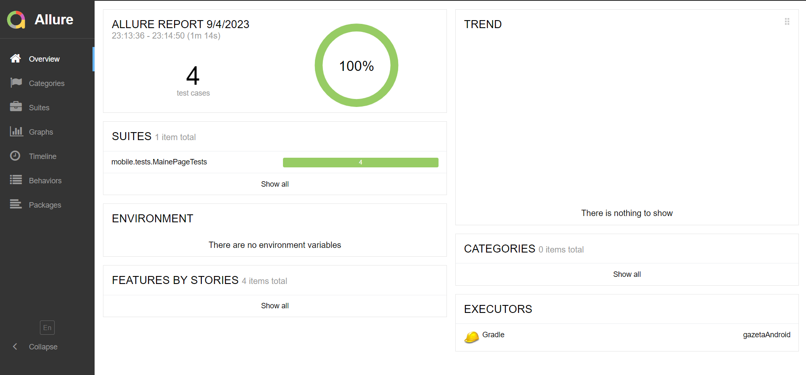
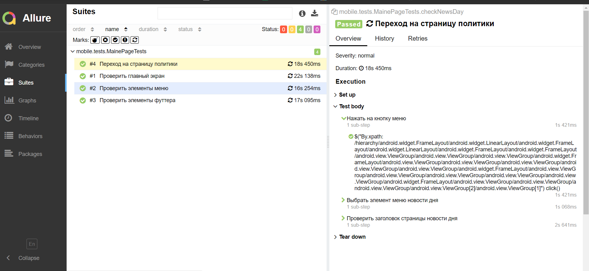

<h1 >Проект по автоматизации тестирования мобильного приложения Gazeta.Ru</h1>


## Содержание 

* <a href="#tools">Технологии и инструменты</a>

* <a href="#cases">Реализованные проверки</a>

* <a href="#console">Запуск тестов из терминала</a>

* <a href="#allure">Allure Report отчеты</a>

## Технологии и инструменты

| Java                                                                                                     | IntelliJ Idea                                                                                                                 | Android Studio                                                                                                                              | GitHub                                                                                                    | JUnit 5                                                                                                           | Gradle                                                                                                     | Selenide                                                                                                         |  Jenkins                                                                                                           |  Appium                                                                                                                      |
|:---------------------------------------------------------------------------------------------------------|-------------------------------------------------------------------------------------------------------------------------------|---------------------------------------------------------------------------------------------------------------------------------------------|-----------------------------------------------------------------------------------------------------------|-------------------------------------------------------------------------------------------------------------------|------------------------------------------------------------------------------------------------------------|------------------------------------------------------------------------------------------------------------------|-------------------------------------------------------------------------------------------------------------------:|------------------------------------------------------------------------------------------------------------------------------|
| <a href="https://www.java.com/"></a> | <a id ="tech" href="https://www.jetbrains.com/idea/"></a> | <a href="https://developer.android.com/studio"></a> | <a href="https://github.com/"></a>| <a href="https://junit.org/junit5/"></a> | <a href="https://gradle.org/"></a> | <a href="https://selenide.org/"></a> |   <a href="https://www.jenkins.io/"></a> | <a href="https://appium.io/"></a>              |


|Allure                                                                                                                         |                                                                                                                                                       
|:------------------------------------------------------------------------------------------------------------------------------|
|<a href="https://github.com/allure-framework"></a>     | 


<a id="cases"></a>
##  Реализованные проверки

-  Проверить элементы главного меню
-  Проверить главный экран
-  Проверить элементы футтера
-  Переход на страницу политики

<a id="console"></a>
##  Запуск тестов из терминала
### Локальный запуск тестов

```
gradle clean test 
```

<a id="allure"></a>
## </a> 

### Основное окно

<p align="center">

</p>

### Тесты

<p align="center">

</p>

